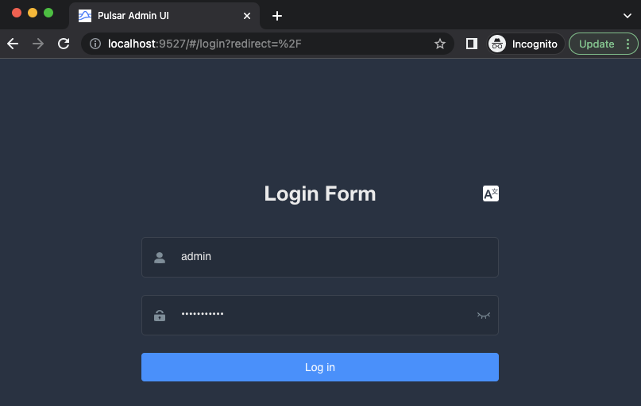

# multi-protocol-pulsar

Requirements
------------

- [Docker](https://www.docker.com/get-started) 4.11+
- [Java](https://openjdk.org/install/) 17+
- [Maven](https://maven.apache.org/download.cgi) 3.8.6+
- [Apache Pulsar](https://pulsar.apache.org/download) 2.10.1+
- [Confluent Platform](https://www.confluent.io/get-started/?product=software) 7.0.5+

Ensure you have allocated enough memory to Docker: at least 8Gb.

On Macs with ARM chip, enabling Rosetta for amd64 emulation on Docker will make your containers boot faster.

🏢 Shared Apache Pulsar Infrastructure
--------------------------------------

Before jumping into any of the scenarios, you must start the shared infrastructure all of them will use. This includes one Zookeeper instance, two Bookkeepers, and two Pulsar brokers.

1️⃣ Start the persistence layer

```bash
sh start-persistence.sh
```

👀 You must wait until the containers `zookeeper`, `persistence-bookie-1`, and `persistence-bookie-2` are healthy to proceed with the next step.

2️⃣ Start the Pulsar brokers with AoP, KoP, and MoP enabled

```bash
sh start-brokers.sh
```

👀 You must wait until the container `broker-1` is healthy to proceed with any next step.


3️⃣ Start the control plane (Optional)

```bash
sh start-control-plane.sh
```

👀 You must wait until the container `pulsar-manager` is healthy before you can access the UI and create an environment. Once the container is running, you should see a screen similar to the following when you visit [http://localhost:9527](http://localhost:9527). Enter `admin` for the username and `apachepulsar` as the password.



Next, you will need to add an environment to the Pulsar Manager. An environment represents a Pulsar instance or a group of clusters you want to manage. A Pulsar Manager is capable of managing multiple environments.

Click "New Environment" button to add an environment.
Input the "Environment Name". The environment name is used for identifying an environment.
Input the "Service URL". The Service URL is the admin service url of your Pulsar cluster.
You need to make sure that Pulsar Manager is able to access the service url. In this example, both the pulsar container and pulsar-manager container use the same docker network. So you can use pulsar container name as the domain name of the pulsar standalone cluster. Thus, you can type http://broker-1:8080 in the service URL box and click on the `confirm` button.


This will create the environment and allow you to manage the Pulsar cluster from the Pulsar Manager UI.


✅ Scenario: Microservice built for AMQP
-------------------------------------------------

This scenario checks two things. First, if AoP provides a truly AMQP-compatible API where third-party frameworks such as [Spring Boot](https://spring.io/projects/spring-boot) can connect with without deployment problems. Second, to check whether we can both send and receive messages using the AMQP protocol using Pulsar.
1️⃣ Run the Spring Boot microservice

```bash
sh microservice-with-amqp/run-microservice.sh
```

👀 You must wait until the microservice connects with the brokers and start producing and consuming messages like this:

```console
i.s.protocols.amqp.demo.MyAmqpListener   : Received [🐰 - I am using AMQP to talk to Pulsar - 1]
```

2️⃣ stop the microservice using Ctrl+C.


✅ Scenario: Microservice built for JMS
-------------------------------------------------

This scenario checks two things. First, if Pulsar provides a truly JMS-compatible API where third-party frameworks such as [Spring Boot](https://spring.io/projects/spring-boot) can connect with without deployment problems. Second, to check whether we can both send and receive messages with the JMS protocol using Pulsar.
1️⃣ Run the Spring Boot microservice

```bash
sh microservice-with-jms/run-microservice.sh
```

👀 You must wait until the microservice connects with the brokers and start producing and consuming messages like this:

```console
i.s.protocols.jms.demo.MyJmsListener     : Received [🦊️ - I am using JMS to talk to Pulsar - 1]
i.s.protocols.jms.demo.MyJmsListener     : Received [🦊️ - I am using JMS to talk to Pulsar - 2]
i.s.protocols.jms.demo.MyJmsListener     : Received [🦊️ - I am using JMS to talk to Pulsar - 3]
i.s.protocols.jms.demo.MyJmsListener     : Received [🦊️ - I am using JMS to talk to Pulsar - 4]
```

2️⃣ stop the microservice using Ctrl+C.

✅ Scenario: Microservice built for Apache Kafka
-------------------------------------------------

This scenario checks two things. First, if KoP provides a truly Kafka-compatible API where third-party frameworks such as [Spring Boot](https://spring.io/projects/spring-boot) can connect with without deployment problems. Second, to check whether we can both send and receive messages using the Kafka protocol using Pulsar.
1️⃣ Run the Spring Boot microservice

```bash
sh microservice-with-kafka/run-microservice.sh
```

👀 You must wait until the microservice connects with the brokers and start producing and consuming messages like this:

```console
i.s.p.kafka.demo.MyKafkaListener         : Received [🐶 - I am using Kafka to talk to Pulsar - 1]
```

2️⃣ stop the microservice using Ctrl+C.


✅ Scenario: Microservice built for MQTT
-------------------------------------------------

This scenario checks two things. First, if MoP provides a truly MQTT-compatible API where third-party frameworks such as [Spring Boot](https://spring.io/projects/spring-boot) can connect with without deployment problems. Second, to check whether we can both send and receive messages using the MQTT protocol using Pulsar.
1️⃣ Run the Spring Boot microservice

```bash
sh microservice-with-mqtt/run-microservice.sh
```

👀 You must wait until the microservice connects with the brokers and start producing and consuming messages like this:

```console
i.s.p.mqtt.demo.MqttMessageListener      : Received [🐱 - I am using MQTT to talk to Pulsar - 1]
```

2️⃣ stop the microservice if you're done for the day using Ctrl+C.


✅ Scenario: Microservice built for Pulsar
-------------------------------------------------

This scenario tests the Pulsar integration with the [Spring Boot](https://spring.io/projects/spring-boot) frameworks. Can we connect with without deployment problems as well as send and receive messages using the `spring-pulsar-spring-boot-starter`.
1️⃣ Run the Spring Boot microservice

```bash
sh microservice-with-pulsar/run-microservice.sh
```

👀 You must wait until the microservice connects with the brokers and start producing and consuming messages like this:

```console
i.s.p.pulsar.demo.MyPulsarListener       : Received [🦄 - I am using Pulsar to talk to Pulsar - 1]
```

2️⃣ stop the microservice if you're done for the day using Ctrl+C.


✅ Scenario: Everyone Publishes to the same topic using different protocols
-------------------------------------------------

This scenario tests if clients using different messaging protocols (AoP, MoP, KoP, and Native Pulsar) can exchange messages on a single common topic.

1️⃣ Run the Spring Boot Aop microservice

```bash
sh microservice-with-amqp/run-microservice.sh
```

👀 The console for the AMQP microservice shows that it only ever consumes messages published using the AMQP protocol:

```console
2022-11-07 02:30:20.887  INFO 1 --- [ntContainer#0-1] i.s.protocols.amqp.demo.MyAmqpListener   : Received [🐰 - I am using AMQP to talk to Pulsar - 110]
2022-11-07 02:30:22.887  INFO 1 --- [ntContainer#0-1] i.s.protocols.amqp.demo.MyAmqpListener   : Received [🐰 - I am using AMQP to talk to Pulsar - 111]
2022-11-07 02:30:24.886  INFO 1 --- [ntContainer#0-1] i.s.protocols.amqp.demo.MyAmqpListener   : Received [🐰 - I am using AMQP to talk to Pulsar - 112]
2022-11-07 02:30:26.891  INFO 1 --- [ntContainer#0-1] i.s.protocols.amqp.demo.MyAmqpListener   : Received [🐰 - I am using AMQP to talk to Pulsar - 113]
2022-11-07 02:30:28.888  INFO 1 --- [ntContainer#0-1] i.s.protocols.amqp.demo.MyAmqpListener   : Received [🐰 - I am using AMQP to talk to Pulsar - 114]
2022-11-07 02:30:30.889  INFO 1 --- [ntContainer#0-1] i.s.protocols.amqp.demo.MyAmqpListener   : Received [🐰 - I am using AMQP to talk to Pulsar - 115]
2022-11-07 02:30:32.890  INFO 1 --- [ntContainer#0-1] i.s.protocols.amqp.demo.MyAmqpListener   : Received [🐰 - I am using AMQP to talk to Pulsar - 116]
2022-11-07 02:30:34.888  INFO 1 --- [ntContainer#0-1] i.s.protocols.amqp.demo.MyAmqpListener   : Received [🐰 - I am using AMQP to talk to Pulsar - 117]
```

2️⃣ In another console window, start the Spring Boot MoP microservice

```bash
sh microservice-with-mqtt/run-microservice.sh
```

3️⃣ In another console window, start the Spring Boot Kafka microservice

```bash
sh microservice-with-kafka/run-microservice.sh
```

4️⃣ Finally, in another console window, start the Spring Boot Pulsar microservice

```bash
sh microservice-with-pulsar/run-microservice.sh
```

👀 Observe the fact that messages from different protocols are getting received by the MoP, KoP, and Pulsar microservices:

In the MoP microservice console:

```console
2022-11-07 02:30:29.611  INFO 1 --- [lTaskExecutor-1] i.s.p.mqtt.demo.MqttMessageListener      : Received [🦄 - I am using Pulsar to talk to Pulsar - 6]
2022-11-07 02:30:30.883  INFO 1 --- [lTaskExecutor-1] i.s.p.mqtt.demo.MqttMessageListener      : Received [🐰 - I am using AMQP to talk to Pulsar - 115]
2022-11-07 02:30:30.930  INFO 1 --- [lTaskExecutor-1] i.s.p.mqtt.demo.MqttMessageListener      : Received [🐶 - I am using Kafka to talk to Pulsar - 17]
2022-11-07 02:30:31.202  INFO 1 --- [lTaskExecutor-1] i.s.p.mqtt.demo.MqttMessageListener      : Received [🐱 - I am using MQTT to talk to Pulsar - 33]
2022-11-07 02:30:32.885  INFO 1 --- [lTaskExecutor-1] i.s.p.mqtt.demo.MqttMessageListener      : Received [🐰 - I am using AMQP to talk to Pulsar - 116]
2022-11-07 02:30:33.202  INFO 1 --- [lTaskExecutor-1] i.s.p.mqtt.demo.MqttMessageListener      : Received [🐱 - I am using MQTT to talk to Pulsar - 34]
2022-11-07 02:30:34.608  INFO 1 --- [lTaskExecutor-1] i.s.p.mqtt.demo.MqttMessageListener      : Received [🦄 - I am using Pulsar to talk to Pulsar - 7]
2022-11-07 02:30:34.882  INFO 1 --- [lTaskExecutor-1] i.s.p.mqtt.demo.MqttMessageListener      : Received [🐰 - I am using AMQP to talk to Pulsar - 117]
2022-11-07 02:30:35.203  INFO 1 --- [lTaskExecutor-1] i.s.p.mqtt.demo.MqttMessageListener      : Received [🐱 - I am using MQTT to talk to Pulsar - 35]
2022-11-07 02:30:35.933  INFO 1 --- [lTaskExecutor-1] i.s.p.mqtt.demo.MqttMessageListener      : Received [🐶 - I am using Kafka to talk to Pulsar - 18]
2022-11-07 02:30:37.204  INFO 1 --- [lTaskExecutor-1] i.s.p.mqtt.demo.MqttMessageListener      : Received [🐱 - I am using MQTT to talk to Pulsar - 36]
```

In the Kafka microservice console:

```console
2022-11-07 02:30:33.257  INFO 1 --- [ntainer#0-0-C-1] i.s.p.kafka.demo.MyKafkaListener         : Received [🐱 - I am using MQTT to talk to Pulsar - 34]
2022-11-07 02:30:34.764  INFO 1 --- [ntainer#0-0-C-1] i.s.p.kafka.demo.MyKafkaListener         : Received [🦄 - I am using Pulsar to talk to Pulsar - 7]
2022-11-07 02:30:35.268  INFO 1 --- [ntainer#0-0-C-1] i.s.p.kafka.demo.MyKafkaListener         : Received [🐰 - I am using AMQP to talk to Pulsar - 117]
2022-11-07 02:30:35.268  INFO 1 --- [ntainer#0-0-C-1] i.s.p.kafka.demo.MyKafkaListener         : Received [🐱 - I am using MQTT to talk to Pulsar - 35]
2022-11-07 02:30:36.276  INFO 1 --- [ntainer#0-0-C-1] i.s.p.kafka.demo.MyKafkaListener         : Received [🐶 - I am using Kafka to talk to Pulsar - 18]
2022-11-07 02:30:37.281  INFO 1 --- [ntainer#0-0-C-1] i.s.p.kafka.demo.MyKafkaListener         : Received [🐱 - I am using MQTT to talk to Pulsar - 36]
2022-11-07 02:30:39.790  INFO 1 --- [ntainer#0-0-C-1] i.s.p.kafka.demo.MyKafkaListener         : Received [🦄 - I am using Pulsar to talk to Pulsar - 8]
2022-11-07 02:30:41.296  INFO 1 --- [ntainer#0-0-C-1] i.s.p.kafka.demo.MyKafkaListener         : Received [🐶 - I am using Kafka to talk to Pulsar - 19]
2022-11-07 02:30:46.298  INFO 1 --- [ntainer#0-0-C-1] i.s.p.kafka.demo.MyKafkaListener         : Received [🐶 - I am using Kafka to talk to Pulsar - 20]
2022-11-07 02:30:51.317  INFO 1 --- [ntainer#0-0-C-1] i.s.p.kafka.demo.MyKafkaListener         : Received [🐶 - I am using Kafka to talk to Pulsar - 21]
```

In the Pulsar microservice console:

```console
2022-11-07T02:30:32.981Z  INFO 1 --- [ntainer#0-0-C-1] i.s.p.pulsar.demo.MyPulsarListener       : Received [🐰 - I am using AMQP to talk to Pulsar - 116]
2022-11-07T02:30:33.287Z  INFO 1 --- [ntainer#0-0-C-1] i.s.p.pulsar.demo.MyPulsarListener       : Received [🐱 - I am using MQTT to talk to Pulsar - 34]
2022-11-07T02:30:34.708Z  INFO 1 --- [ntainer#0-0-C-1] i.s.p.pulsar.demo.MyPulsarListener       : Received [🦄 - I am using Pulsar to talk to Pulsar - 7]
2022-11-07T02:30:34.912Z  INFO 1 --- [ntainer#0-0-C-1] i.s.p.pulsar.demo.MyPulsarListener       : Received [🐰 - I am using AMQP to talk to Pulsar - 117]
2022-11-07T02:30:35.217Z  INFO 1 --- [ntainer#0-0-C-1] i.s.p.pulsar.demo.MyPulsarListener       : Received [🐱 - I am using MQTT to talk to Pulsar - 35]
2022-11-07T02:30:36.028Z  INFO 1 --- [ntainer#0-0-C-1] i.s.p.pulsar.demo.MyPulsarListener       : Received [🐶 - I am using Kafka to talk to Pulsar - 18]
2022-11-07T02:30:37.243Z  INFO 1 --- [ntainer#0-0-C-1] i.s.p.pulsar.demo.MyPulsarListener       : Received [🐱 - I am using MQTT to talk to Pulsar - 36]
2022-11-07T02:30:39.675Z  INFO 1 --- [ntainer#0-0-C-1] i.s.p.pulsar.demo.MyPulsarListener       : Received [🦄 - I am using Pulsar to talk to Pulsar - 8]
2022-11-07T02:30:40.991Z  INFO 1 --- [ntainer#0-0-C-1] i.s.p.pulsar.demo.MyPulsarListener       : Received [🐶 - I am using Kafka to talk to Pulsar - 19]
```

Pretty cool, huh?

✅ Shutting down
-------------------------------------------------

When you are finished with your testing, you can stop all docker containers using the following command:

```bash
sh stop-everything.sh
```


References
-------------------------------------------------
1. https://docs.spring.io/spring-pulsar/docs/current-SNAPSHOT/reference/html/#_introduction