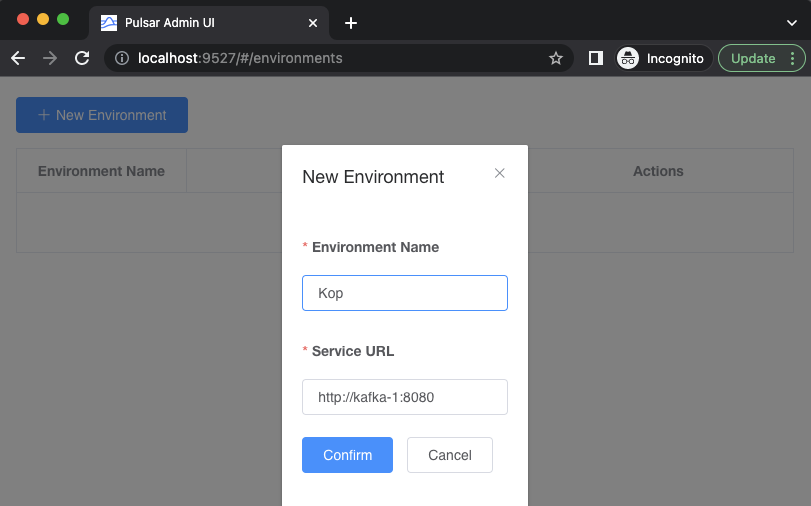

# multi-protocol-pulsar

Requirements
------------

- [Docker](https://www.docker.com/get-started) 4.11+
- [Java](https://openjdk.org/install/) 17+
- [Maven](https://maven.apache.org/download.cgi) 3.8.6+
- [Apache Pulsar](https://pulsar.apache.org/download) 2.10.1+
- [Confluent Platform](https://www.confluent.io/get-started/?product=software) 7.0.5+

🏢 Shared Apache Pulsar Infrastructure
--------------------------------------

Before jumping into any of the scenarios, you must start the shared infrastructure all of them will use. This includes one Zookeeper instance, two Bookkeepers, and two Pulsar brokers.

1️⃣ Start the persistence layer

```bash
sh start-persistence.sh
```

👀 You must wait until the containers `zookeeper`, `persistence-bookie-1`, and `persistence-bookie-2` are healthy to proceed with the next step.

2️⃣ Start the Pulsar brokers with KoP enabled

```bash
sh start-brokers.sh
```

👀 You must wait until the container `broker-1` is healthy to proceed with any next step.


3️⃣ Start the control plane (Optional)

```bash
sh start-control-plane.sh
```

👀 You must wait until the container `pulsar-manager` is healthy before you can access the UI and create an environment. Once the container is running, you should see a screen similar to the following when you visit [http://localhost:9527](http://localhost:9527). Enter `admin` for the username and `apachepulsar` as the password.


Next, you will need to add an environment to the Pulsar Manager. An environment represents a Pulsar instance or a group of clusters you want to manage. A Pulsar Manager is capable of managing multiple environments.

Click "New Environment" button to add an environment.
Input the "Environment Name". The environment name is used for identifying an environment.
Input the "Service URL". The Service URL is the admin service url of your Pulsar cluster.
You need to make sure the service url that Pulsar Manager is able to access. In this example, both the pulsar container and pulsar-manager container use the same docker network. So you can use pulsar container name as the domain name of the pulsar standalone cluster. Thus you can type http://kafka-1:8080 in the service URL box and click on the `confirm` button.



This will create the environment and allow you to manage the Pulsar cluster from the Pulsar Manager UI.


✅ Scenario: Microservice built for Apache Kafka
-------------------------------------------------

This scenario checks two things. First, if KoP provides a truly Kafka-compatible API where third-party frameworks such as [Spring Boot](https://spring.io/projects/spring-boot) can connect with without deployment problems. Second, to check whether KoP is capable of mimic the distributed protocol from Kafka. Kafka is not just a one-directional typical client-server protocol. Instead, it is a bi-directional protocol where messages are exchanged from both parties. A good example is when a producer connects to the Kafka cluster using one bootstrap server endpoint, and the cluster keeps periodically updating that list back to the producer with metadata about the new cluster formation. Same for the consumer, which after joining a group, may be eventually removed by the cluster for the absence of valid heartbeats.

To validate this scenario, two Apache Pulsar brokers with KoP enabled will be executed, and the microservice will use the endpoint of only one broker to bootstrap the cluster. When everything is up-and-running and working as expected, the broker being used by the microservice will be killed, and the assumption is that the microservice should fallback to the other available broker, and continue its execution. If that ever happens, it means that the bootstrap worked as expected, giving the specifications of how Kafka manages clusters and sends this information to its clients.

1️⃣ Run the Spring Boot microservice

```bash
sh microservice-with-kafka/run-microservice.sh
```

👀 You must wait until the microservice connects with the brokers and start producing and consuming messages like this:

```console
io.streamnative.protocols.kafka.demo.KafkaMessageProducer : I am using Kafka to talk to Pulsar 😄
```

#️⃣ stop all containers if you're done for the day.

```bash
sh stop-everything.sh
```
